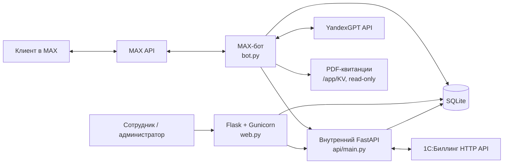

# РСО MAX

РСО MAX — сервис коммуникации ресурсоснабжающей организации с клиентами в
мессенджере MAX. В одном приложении объединены MAX-бот, операторская веб-панель,
внутренний API и интеграции с 1С:Биллинг и YandexGPT.

Проект позволяет клиенту авторизоваться по лицевому счёту, передавать показания,
получать квитанции, создавать обращения, проходить FAQ-сценарии, записываться на
приём и переходить в диалог с оператором. Сотрудники работают с обращениями,
диалогами, пользователями, лицевыми счетами, FAQ, филиалами, расписанием и
домовыми чатами через закрытую веб-панель.

> Текущая интеграция с 1С поддерживает mock-режим. Для production необходимо
> реализовать и проверить внешний HTTP-сервис 1С по контракту из
> [docs/1C_API.md](docs/1C_API.md).

## Возможности

- авторизация клиента по лицевому счёту через 1С;
- приём одно- и многотарифных показаний и их пакетная синхронизация;
- обращения, ответы сотрудников, статусы и уведомления в MAX;
- настраиваемые FAQ-деревья, включая ссылки и переход к ИИ-помощнику;
- YandexGPT с системным промптом, дневным лимитом и очисткой персональных данных;
- живой диалог клиента с одним назначенным оператором, очередь, балансировка и
  переназначение между несколькими работающими операторами, изображения, оценки
  и жалобы;
- запись на приём, филиалы, расписания, исключения и напоминания;
- выдача PDF-квитанций из закрытого runtime-каталога;
- домовые чаты, сценарии реакции, исключения и рассылки;
- включение и выключение модулей главного меню из панели администратора;
- раздельные тестовый и production Docker-контуры на одном сервере.

## Архитектура



В Docker запускаются три процесса из одного образа:

| Компонент | Роль |
| --- | --- |
| `bot` | Long polling MAX, пользовательские сценарии, планировщик и напоминания |
| `web` | Закрытая Flask-панель; в production обслуживается Gunicorn |
| `api` | Внутренний FastAPI для обращений, FAQ, домовых чатов и интеграции с 1С |
| SQLite | Единое хранилище приложения; соединения используют WAL |
| 1С:Биллинг | Авторизация клиента, счётчики и приём показаний |
| YandexGPT | Ответы ИИ-помощника; API-ключ хранится только в окружении |
| MAX API | Приём обновлений, сообщения, callback-кнопки и медиа |

FastAPI не публикуется на хост. Веб-панель Docker привязывает только к
`127.0.0.1`, а наружный доступ организуется через SSH-туннель или настроенный
reverse proxy. Несколько процессов не следует объединять в один: API содержит
планировщик синхронизации 1С, а бот — планировщик пользовательских задач.

## Структура репозитория

| Путь | Назначение |
| --- | --- |
| `bot.py` | Точка входа MAX-бота и диспетчеризация событий |
| `web.py`, `templates/` | Flask-панель и HTML-шаблоны |
| `api/` | FastAPI, схемы, зависимости и роутеры |
| `rso_bot/flows/` | Авторизация, обращения, FAQ, ИИ, показания, квитанции и запись |
| `rso_bot/operator_chat.py` | Очередь и доставка сообщений живого диалога |
| `rso_bot/jobs/`, `rso_bot/scheduler.py` | Фоновые задания и напоминания |
| `database.py` | Схема SQLite, миграции и слой доступа к данным |
| `client_1c.py`, `sync_1c.py` | Клиент 1С и пакетная синхронизация |
| `client_api.py` | Внутренний клиент bot/web → FastAPI |
| `compose.yaml`, `Dockerfile` | Контейнеризация сервисов |
| `scripts/` | Развёртывание, backup, smoke-тест и проверка MAX-токена |
| `tests/` | Автоматические тесты |
| `docs/` | Контракты интеграций и процесс GitHub |

## Требования

Для Docker-запуска:

- Linux-сервер или рабочая станция с Docker Engine и Compose v2;
- отдельный токен MAX-бота для каждого контура;
- права записи в локальный каталог `runtime/`.

Для разработки без Docker:

- Python 3.12;
- зависимости из `requirements-dev.txt`;
- доступ к MAX, 1С и YandexGPT только для проверки соответствующих интеграций.

## Быстрый запуск в Docker

Этот вариант запускает API и веб-панель без MAX-бота, реальной 1С и YandexGPT.
Он подходит для первичного знакомства с интерфейсом.

1. Создайте локальные конфигурационные файлы.

   Linux/macOS:

   ```bash
   cp .env.example .env
   cp .env.runtime.example .env.runtime
   chmod 600 .env .env.runtime
   ```

   Windows PowerShell:

   ```powershell
   Copy-Item .env.example .env
   Copy-Item .env.runtime.example .env.runtime
   ```

   На Windows доступ ограничивается ACL текущего пользователя и каталога
   проекта, поэтому `chmod` не применяется. Храните рабочую копию в закрытом
   пользовательском каталоге, не раздавайте доступ к env-файлам и не добавляйте
   их в Git: они уже исключены правилами `.gitignore`.

2. В `.env` задайте уникальные случайные `SECRET_KEY` (не менее 32 символов) и
   `INTERNAL_API_TOKEN`. Не копируйте значения из чужих контуров.

3. В `.env.runtime` временно задайте `BOOTSTRAP_ADMIN_PASSWORD` длиной не менее
   12 символов. Это одноразовый пароль первого администратора `admin`.

4. До сборки подготовьте каталоги bind mount. На Linux образ нужно собрать с
   UID/GID обычного пользователя, который владеет `runtime`: это позволяет
   непривилегированному пользователю контейнера писать базу, логи и backup.

   ```bash
   export APP_UID="$(id -u)"
   export APP_GID="$(id -g)"
   mkdir -p runtime/data runtime/logs runtime/backups runtime/kv
   chmod 700 runtime/data runtime/backups
   chmod 750 runtime/logs runtime/kv
   test -w runtime/data && test -w runtime/logs && test -w runtime/backups
   ```

   Если каталоги уже принадлежат другому пользователю, сначала проверьте их
   командой `ls -ld runtime runtime/*` и исправьте владельца именно каталога
   проекта, например `sudo chown -R "$(id -u):$(id -g)" runtime`. Не заменяйте
   это выдачей прав `777`. Скрипт серверного развёртывания выполняет такую же
   привязку к UID/GID и дополнительно запрещает UID/GID `0`.

   В Docker Desktop для Windows/macOS доступ к bind mount управляется Docker
   Desktop. Создайте каталоги заранее; Compose и Dockerfile по умолчанию
   согласованы на `APP_UID=1000` и `APP_GID=1000`:

   ```powershell
   $env:APP_UID = "1000"
   $env:APP_GID = "1000"
   New-Item -ItemType Directory -Force `
     runtime/data, runtime/logs, runtime/backups, runtime/kv | Out-Null
   ```

   Если в Docker Desktop настроено собственное отображение UID/GID, укажите
   вместо `1000` согласованные с ним значения.

5. Соберите и запустите сервисы из того же терминала, чтобы Compose получил
   заданные `APP_UID` и `APP_GID`.

   Linux/macOS:

   ```bash
   docker compose up --build -d api web
   docker compose ps
   curl --fail http://127.0.0.1:5000/healthz
   ```

   Windows PowerShell (после PowerShell-команд из шагов 1 и 4):

   ```powershell
   docker compose up --build -d api web
   docker compose ps
   curl.exe --fail http://127.0.0.1:5000/healthz
   ```

   Вместо `curl.exe` можно использовать
   `Invoke-WebRequest http://127.0.0.1:5000/healthz`.

6. Откройте <http://127.0.0.1:5000>, войдите как `admin` и смените пароль.
   После этого очистите `BOOTSTRAP_ADMIN_PASSWORD` и пересоздайте сервисы:

   ```console
   docker compose up -d --force-recreate api web
   ```

Чтобы запустить бота, заполните `TOKEN` и выполните:

```console
docker compose --profile bot up -d bot
```

Для серверного test/prod-развёртывания не используйте этот сокращённый порядок —
следуйте [DEPLOYMENT.md](DEPLOYMENT.md).

## Конфигурация

Полный безопасный шаблон основных параметров находится в
[`.env.example`](.env.example), а серверные runtime-настройки — в
[`.env.runtime.example`](.env.runtime.example). При Docker-запуске runtime-файл
подключается после основного и имеет приоритет.

| Переменная | Назначение |
| --- | --- |
| `DB_PATH` | Путь к SQLite; в Compose — `/app/data/database.sqlite` |
| `APP_ENV` | Режим приложения: `development`, `test` или `production` |
| `TOKEN` | Секретный токен MAX-бота |
| `SECRET_KEY` | Ключ сессий Flask; в production минимум 32 символа |
| `BOOTSTRAP_ADMIN_PASSWORD` | Одноразовый пароль первого администратора |
| `INTERNAL_API_TOKEN` | Bearer-токен внутренних вызовов FastAPI |
| `FASTAPI_BASE_URL` | Адрес внутреннего API для bot/web |
| `ENABLE_1C_INTEGRATION` | Включает фоновую интеграцию с 1С |
| `INTEGRATION_1C_MOCK` | Локальная имитация 1С; запрещена в production |
| `INTEGRATION_1C_BASE_URL` | Базовый HTTPS URL HTTP-сервиса 1С |
| `INTEGRATION_1C_AUTH_TOKEN` | Общий Bearer-токен приложения и 1С |
| `YANDEXGPT_API_KEY` | API-ключ YandexGPT |
| `YANDEXGPT_FOLDER_ID` | Идентификатор каталога Yandex Cloud |
| `OPERATOR_CHAT_IMAGE_DIR` | Закрытый каталог изображений операторского чата |
| `MAX_IMAGE_DOWNLOAD_HOSTS` | Allowlist хостов загрузки изображений MAX |
| `WEB_WORKERS`, `WEB_THREADS` | Процессы и потоки веб-панели; по умолчанию `2 × 4` |
| `WEB_TIMEOUT` | Timeout Gunicorn, по умолчанию 60 секунд |
| `TRUSTED_PROXY_CIDRS` | Allowlist непосредственных reverse proxy для forwarded IP |
| `EXPECT_REVERSE_PROXY` | Требовать корректную настройку reverse proxy при старте |

Настройки модели, системного промпта, лимита и генерации YandexGPT задаются в
административной панели. `YANDEXGPT_API_KEY` и остальные секреты через панель не
сохраняются.

Никогда не добавляйте `.env`, `.env.*.runtime`, SQLite, логи, PDF-квитанции,
изображения клиентов или реальные персональные данные в Git.

## Локальная разработка

PowerShell:

```powershell
py -3.12 -m venv .venv
.\.venv\Scripts\Activate.ps1
python -m pip install -r requirements-dev.txt
Copy-Item .env.example .env
```

Bash:

```bash
python3.12 -m venv .venv
source .venv/bin/activate
python -m pip install -r requirements-dev.txt
cp .env.example .env
```

Укажите в локальном `.env` безопасные development-значения. Для работы без
Bearer-токена допустимо только в `development`/`test` явно установить
`ALLOW_INSECURE_DEV_API=true`; предпочтительно настроить `INTERNAL_API_TOKEN`.

Запускайте процессы в отдельных терминалах:

```bash
python -m uvicorn api.main:app --host 127.0.0.1 --port 8000
python web.py
python bot.py  # только если задан TOKEN
```

Все процессы должны использовать один `DB_PATH`. `web.py` доступен на
<http://127.0.0.1:5000>, FastAPI — на <http://127.0.0.1:8000>.

Для локальной демонстрационной базы можно выполнить `python seed_demo.py`.
Скрипт добавляет вымышленные лицевые счета и счётчики в базу из `DB_PATH`; не
запускайте его на production-данных.

## URL и проверки состояния

| URL | Доступ | Назначение |
| --- | --- | --- |
| `http://127.0.0.1:5000/` | Через Flask | Веб-панель |
| `http://127.0.0.1:5000/healthz` | Локальный | Health-check web |
| `http://127.0.0.1:8000/healthz` | Внутренний | Health-check API |
| `http://127.0.0.1:8000/api/docs` | Внутренний | Swagger UI |
| `http://127.0.0.1:8000/api/redoc` | Внутренний | ReDoc |
| `http://127.0.0.1:8000/api/openapi.json` | Внутренний | OpenAPI-схема |

В Compose порт API не опубликован. Проверять его можно из контейнера или Docker-
сети. В production веб-панель также остаётся на loopback; порядок SSH-доступа
описан в [DEPLOYMENT.md](DEPLOYMENT.md#первый-запуск).

## База данных, миграции и резервные копии

Приложение использует SQLite. `init_db()` вызывается при старте каждого процесса
и идемпотентно создаёт недостающие таблицы и колонки. Отдельного инструмента
версий миграций сейчас нет. Поэтому перед обновлением обязательно создавайте
согласованную резервную копию:

```bash
./scripts/backup.sh test
./scripts/backup.sh prod
```

Скрипт использует SQLite Backup API, проверяет `PRAGMA integrity_check`, атомарно
публикует готовый файл и удаляет копии старше 30 дней. Не копируйте работающий
файл базы обычной файловой командой. Путь обновления и требования к откату
описаны в разделе [обновления DEPLOYMENT.md](DEPLOYMENT.md#обновление-только-из-main-сначала-test-затем-prod).

Runtime-данные размещаются отдельно от Git:

- `runtime/<контур>/data` — SQLite, heartbeat и изображения;
- `runtime/<контур>/logs` — журналы;
- `runtime/<контур>/backups` — проверенные копии;
- `runtime/<контур>/kv` — PDF-квитанции, монтируются только для чтения.

## Тесты и проверки качества

Установите development-зависимости и запустите те же проверки, что выполняет CI:

```bash
python -m pytest -q -p no:cacheprovider
python -m compileall -q -f -x '(^|[\\/])(\.git|\.venv)([\\/]|$)' .
ruff check . --select E9,F63,F7,F82
bandit -r . -x ./tests -lll
pip-audit -r requirements.txt --strict
```

Ruff пока работает как блокирующий baseline только для синтаксических ошибок и
неопределённых имён. Полный набор правил ещё не объявлен чистым.

CI определён в [`.github/workflows/ci.yml`](.github/workflows/ci.yml). Job,
который должен быть зелёным перед слиянием, называется
`Tests and quality checks`.

## Ветки и Pull Request

Рабочая ветка создаётся от актуального `main` и называется
`feature/<описание>`, `fix/<описание>`, `hotfix/<описание>` или
`docs/<описание>`. Незавершённая работа открывается как Draft PR. Перед слиянием
нужны:

- тесты и зелёный `Tests and quality checks`;
- независимое ревью;
- отсутствие P0/P1 и нерешённых обсуждений;
- описание миграций, конфигурации, рисков и отката;
- отсутствие секретов и пользовательских данных в diff.

Полные правила, временные `integration/**` и `review/**`, а также рекомендуемая
защита `main` описаны в
[docs/GITHUB_INFRASTRUCTURE.md](docs/GITHUB_INFRASTRUCTURE.md). Роли агентов и
критерии готовности находятся в [AGENTS.md](AGENTS.md).

## Production-развёртывание

На сервере поддерживаются два изолированных Compose-проекта:

- `test`: порт веб-панели `5001`, `.env.test` + `.env.test.runtime`,
  `runtime/test`;
- `prod`: порт веб-панели `5000`, `.env` + `.env.prod.runtime`, `runtime/prod`.

Единственный источник релиза — проверенный commit из `main`. Сначала один и тот
же SHA разворачивается и принимается в `test`, затем — в `prod`:

```bash
./scripts/deploy.sh test
./scripts/smoke.sh test
# после приёмки того же SHA и backup production:
./scripts/deploy.sh prod
```

Скрипт развёртывания проверяет MAX-токен через официальный `GET /me` и запрещает
использовать одного бота одновременно в двух контурах. Полная подготовка env,
backup, smoke-monitoring, reverse proxy, обновление и откат описаны только в
[DEPLOYMENT.md](DEPLOYMENT.md); этот README не заменяет инструкцию оператора.

## Безопасность и персональные данные

- секреты хранятся только в серверных env-файлах с ограниченными правами;
- `test` и `prod` используют разные токены и ключи;
- внутренние изменяющие API требуют `Authorization: Bearer`;
- FastAPI не должен публиковаться в интернет;
- доверять `X-Forwarded-For` можно только от адресов в `TRUSTED_PROXY_CIDRS`;
- контейнеры запускаются непривилегированным пользователем, с read-only root FS,
  `no-new-privileges` и без Linux capabilities;
- SQLite, логи, квитанции, изображения и персональные данные исключены из Git;
- при попадании секрета в Git его нужно немедленно отозвать и заменить — одного
  удаления файла недостаточно;
- перед отправкой вопроса в YandexGPT приложение очищает известные персональные
  данные, но настройку промпта и реальные журналы всё равно следует проверять в
  рамках политики обработки данных организации.

## Диагностика

**Веб-панель не открывается.** Проверьте `docker compose ps`, затем
`docker compose logs web api`. Панель привязана к `127.0.0.1`; для удалённого
сервера нужен SSH-туннель или reverse proxy.

**FastAPI возвращает 401/503.** Убедитесь, что `INTERNAL_API_TOKEN` одинаков для
bot/web/API, `FASTAPI_BASE_URL` указывает на доступный API, а контейнер `api`
имеет статус healthy. Небезопасный режим разрешён только локально.

**Бот не запускается или не отвечает.** Проверьте `TOKEN`, доступ к
`https://platform-api2.max.ru`, логи `bot` и свежесть файла heartbeat. Для
серверного запуска `deploy.sh` предварительно проверяет личность бота через
`GET /me`.

**Не работает 1С.** Проверьте `ENABLE_1C_INTEGRATION`, режим mock, URL, токен и
timeouts. Если локальные запросы перехватывает proxy/VPN, добавьте
`NO_PROXY=127.0.0.1,localhost`. Контракт и коды ошибок приведены в
[docs/1C_API.md](docs/1C_API.md).

**Не отвечает ИИ-помощник.** Проверьте `YANDEXGPT_API_KEY`,
`YANDEXGPT_FOLDER_ID`, доступность API и то, что модуль включён в панели. Модель,
лимит и системный промпт задаются отдельно в административных настройках.

**Gunicorn не стартует.** Значения `WEB_WORKERS`, `WEB_THREADS` и `WEB_TIMEOUT`
проверяются строго и должны находиться в допустимых диапазонах. Начните с
значений из `.env.runtime.example`: 2 процесса, 4 потока, 60 секунд.

**Ошибка после обновления схемы.** Не пытайтесь вручную править production-базу.
Сохраните логи, остановите продвижение релиза и действуйте по процедуре backup и
отката из [DEPLOYMENT.md](DEPLOYMENT.md).

## Документация

- [DEPLOYMENT.md](DEPLOYMENT.md) — закрытый Docker-стенд, test/prod, backup и
  продвижение релиза;
- [docs/GITHUB_INFRASTRUCTURE.md](docs/GITHUB_INFRASTRUCTURE.md) — ветки, PR,
  CI, защита `main` и хранение секретов;
- [docs/1C_API.md](docs/1C_API.md) — контракт приложения с 1С;
- [AGENTS.md](AGENTS.md) — процесс разработки, ревью и тестирования;
- [TOR_1C_INTEGRATION_PART1_AUTH (2).md](TOR_1C_INTEGRATION_PART1_AUTH%20%282%29.md)
  — требования к авторизации через 1С;
- [TOR_1C_INTEGRATION_PART2_READINGS.md](TOR_1C_INTEGRATION_PART2_READINGS.md)
  — требования к передаче показаний.
